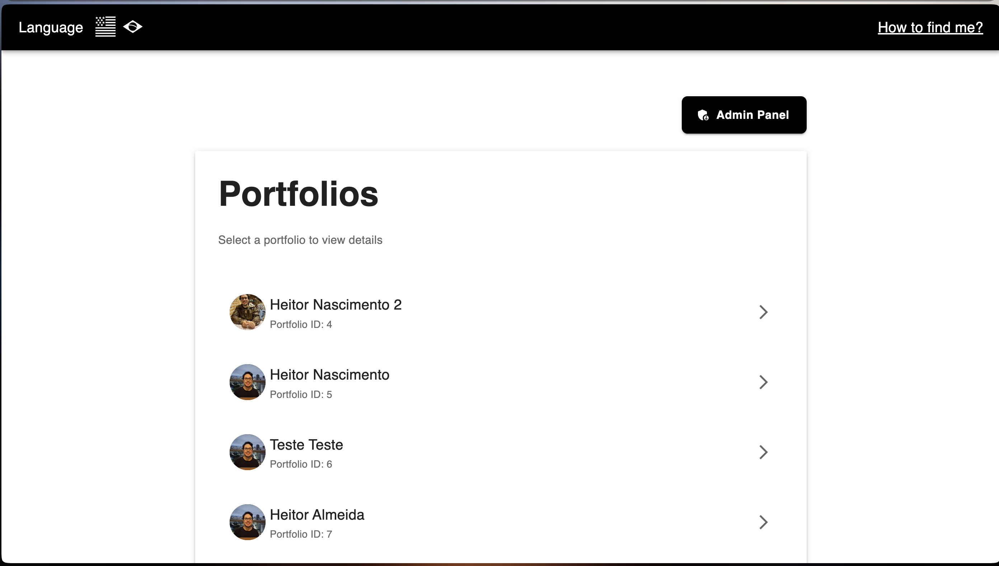
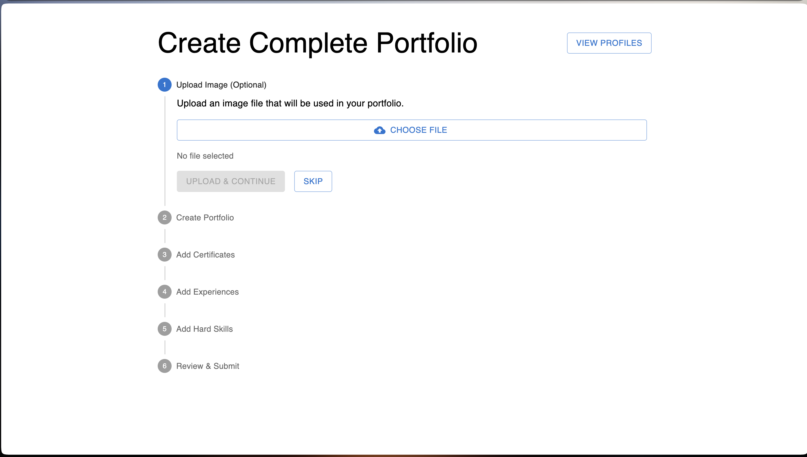
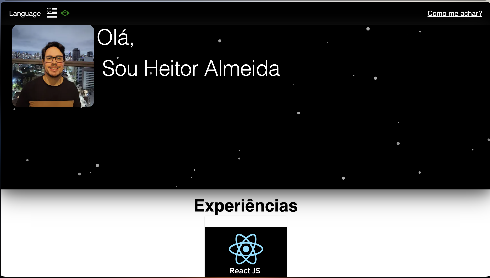

# 🚀 Portfolio Full-Stack Application

> A modern, production-ready portfolio platform built with Next.js and NestJS

## 📋 Overview

This is a full-stack portfolio application that showcases professional experiences, skills, certifications, and projects. The application features a dynamic admin panel for content management and a beautiful, responsive frontend for visitors.

## ✨ Features

- **📱 Responsive Design** - Optimized for all devices and screen sizes
- **⚡ Server-Side Rendering** - Built with Next.js for optimal performance and SEO
- **🎨 Modern UI** - Styled with Styled Components, Tailwind CSS, and Material-UI
- **🔐 Admin Dashboard** - Secure content management system
- **📊 Dynamic Content** - Manage experiences, skills, certifications, and portfolio items
- **🖼️ File Management** - Upload and manage images and documents
- **🗄️ PostgreSQL Database** - Robust data persistence with TypeORM
- **🎯 Type Safety** - Full TypeScript implementation across frontend and backend
- **🔄 Real-time Updates** - Context API for state management
- **🌐 Multi-language Support** - Built-in internationalization

## � Screenshots

### Home Page


### Admin Dashboard


### Portfolios Section


## Portifolio Screeen



## �🛠️ Tech Stack

### Frontend
- **Framework:** Next.js 13.4
- **Language:** TypeScript 5.0
- **Styling:** 
  - Styled Components
  - Tailwind CSS
  - Material-UI (MUI)
- **State Management:** React Context API
- **Animations:** tsParticles
- **Icons:** React Icons, MUI Icons

### Backend
- **Framework:** NestJS 10.0
- **Language:** TypeScript
- **ORM:** TypeORM 0.3
- **Database:** PostgreSQL
- **File Upload:** Multer
- **API:** RESTful architecture

### DevOps & Tools
- **Package Manager:** pnpm
- **Task Runner:** Task (Taskfile)
- **Linting:** ESLint
- **Testing:** Jest

## 📁 Project Structure

```
Portifolio/
├── backend/              # NestJS API
│   ├── src/
│   │   ├── Certificate/  # Certificate management module
│   │   ├── Experience/   # Experience management module
│   │   ├── HardSkill/    # Skills management module
│   │   ├── Portifolio/   # Portfolio items module
│   │   ├── files/        # File upload module
│   │   ├── database/     # Database config, migrations & seeds
│   │   └── dto/          # Data Transfer Objects
│   └── upload/           # Uploaded files storage
│
└── frontend/             # Next.js application
    ├── app/              # Next.js 13 app directory
    ├── api/              # API type definitions
    ├── components/       # React components
    │   ├── Banner/
    │   ├── Courses/
    │   ├── Experiences/
    │   ├── Skills/
    │   └── Footer/
    ├── context/          # React Context providers
    ├── hooks/            # Custom React hooks
    ├── pages/            # Page components
    └── utils/            # Utility functions
```

## 🚀 Getting Started

### Prerequisites

- Node.js (v16 or higher)
- pnpm (v8 or higher)
- PostgreSQL (v12 or higher)
- [Task](https://taskfile.dev/) (optional, for simplified commands)

### Installation

1. **Clone the repository**
   ```bash
   git clone <repository-url>
   cd Portifolio
   ```

2. **Install dependencies**
   ```bash
   # Backend
   cd backend
   pnpm install

   # Frontend
   cd ../frontend
   pnpm install
   ```

3. **Configure environment variables**
   
   Create `.env` files in both backend and frontend directories:
   
   **Backend `.env`:**
   ```env
   # Database
   DB_HOST=localhost
   DB_PORT=5432
   DB_USERNAME=your_username
   DB_PASSWORD=your_password
   DB_DATABASE=portfolio_db
   
   # Application
   PORT=3001
   ```
   
   **Frontend `.env.local`:**
   ```env
   NEXT_PUBLIC_API_URL=http://localhost:3001
   ```

4. **Setup database**
   ```bash
   cd backend
   
   # Run migrations
   pnpm run migration:run
   
   # Seed database (optional)
   pnpm run seed
   ```

### Running the Application

#### Using Task (Recommended)

```bash
# Run both frontend and backend
task dev

# Run backend only
task backend

# Run frontend only
task frontend
```

#### Manual Start

```bash
# Terminal 1 - Backend
cd backend
pnpm run start:dev

# Terminal 2 - Frontend
cd frontend
pnpm run dev
```

The application will be available at:
- **Frontend:** http://localhost:3000
- **Backend:** http://localhost:3001

## 🔧 Development

### Database Migrations

```bash
cd backend

# Generate a new migration
pnpm run migration:generate -- src/database/migrations/MigrationName

# Create an empty migration
pnpm run migration:create -- src/database/migrations/MigrationName

# Run migrations
pnpm run migration:run

# Revert last migration
pnpm run migration:revert
```

### Code Quality

```bash
# Backend
cd backend
pnpm run lint        # Lint code
pnpm run format      # Format code
pnpm run test        # Run tests
pnpm run test:e2e    # Run e2e tests

# Frontend
cd frontend
pnpm run lint        # Lint code
```

## 📦 Build for Production

```bash
# Backend
cd backend
pnpm run build
pnpm run start:prod

# Frontend
cd frontend
pnpm run build
pnpm run start
```

## 🎯 API Endpoints

### Experiences
- `GET /experience` - List all experiences
- `POST /experience` - Create new experience
- `PUT /experience/:id` - Update experience
- `DELETE /experience/:id` - Delete experience

### Skills
- `GET /hard-skill` - List all skills
- `POST /hard-skill` - Create new skill
- `PUT /hard-skill/:id` - Update skill
- `DELETE /hard-skill/:id` - Delete skill

### Certificates
- `GET /certificate` - List all certificates
- `POST /certificate` - Create new certificate
- `PUT /certificate/:id` - Update certificate
- `DELETE /certificate/:id` - Delete certificate

### Portfolio
- `GET /portifolio` - List all portfolio items
- `POST /portifolio` - Create new portfolio item
- `PUT /portifolio/:id` - Update portfolio item
- `DELETE /portifolio/:id` - Delete portfolio item

### Files
- `POST /files/upload` - Upload file
- `GET /files/:filename` - Get file

## 🤝 Contributing

Contributions are welcome! Please feel free to submit a Pull Request.

## 📝 License

This project is licensed under the UNLICENSED License.

## 👤 Author

**Heitor**

---

<p align="center">Built using Next.js and NestJS</p>
